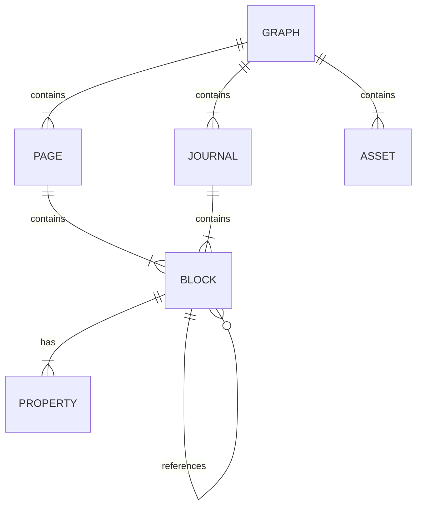

# Data Model: LogSeq to Obsidian Converter

**Date**: 2025-11-27
**Status**: Done

This document outlines the key data entities involved in the conversion process, as derived from the feature specification.

## Entity-Relationship Diagram (Conceptual)

## Entity Definitions

### Graph
The top-level container for all notes and assets.

- **Attributes**:
    - `source_path` (string): The absolute path to the source LogSeq graph directory.
    - `destination_path` (string): The absolute path to the destination Obsidian vault directory.
    - `pages` (list of Page): Collection of standard note files.
    - `journals` (list of Journal): Collection of daily note files.
    - `assets` (list of Asset): Collection of asset files (images, PDFs, etc.).

### Page
A standard Markdown note.

- **Attributes**:
    - `filename` (string): The original filename (e.g., `Category___Topic.md`).
    - `content` (string): The raw Markdown content of the file.
    - `blocks` (list of Block): A list of the blocks that make up the page.
    - `properties` (dict): Key-value pairs that will be converted to YAML frontmatter.

- **State Transitions**:
    - `A___B.md` is transformed into `A/B.md` in the destination vault.

### Journal
A daily note.

- **Attributes**:
    - `filename` (string): The original filename (e.g., `2025_11_27.md`).
    - `date` (datetime): The date of the journal entry.
    - `content` (string): The raw Markdown content of the file.
    - `blocks` (list of Block): A list of the blocks that make up the journal.

- **State Transitions**:
    - `YYYY_MM_DD.md` is transformed into `Daily/YYYY-MM-DD.md` in the destination vault.

### Block
A single unit of content within a Page or Journal, typically a paragraph or a bullet point.

- **Attributes**:
    - `id` (string): The unique UUID assigned by LogSeq (e.g., `6383a3e6-b99a-41d9-9635-a1c6a3b9d3d3`).
    - `content` (string): The textual content of the block.
    - `properties` (dict): Key-value pairs defined within the block (e.g., `key:: value`).
    - `children` (list of Block): A list of nested child blocks (sub-bullets).

- **State Transitions**:
    - The LogSeq `id` is used to generate an Obsidian block anchor (`^blockid`).
    - `((uuid))` references are converted to `[[filename#^blockid]]` links.
    - `properties` are moved to the file's YAML frontmatter.

### Asset
A non-Markdown file, like an image or a PDF.

- **Attributes**:
    - `filename` (string): The name of the asset file.
    - `path` (string): The path to the asset file within the `assets` directory.

- **State Transitions**:
    - Copied as-is from the source `assets` directory to the destination `assets` directory.

### Property
A key-value pair associated with a Block.

- **Attributes**:
    - `key` (string): The property key.
    - `value` (string): The property value.

- **State Transitions**:
    - Moved from the block to the YAML frontmatter of the containing file. If a key already exists in the frontmatter, values may be appended or handled according to a defined rule (TBD in implementation).