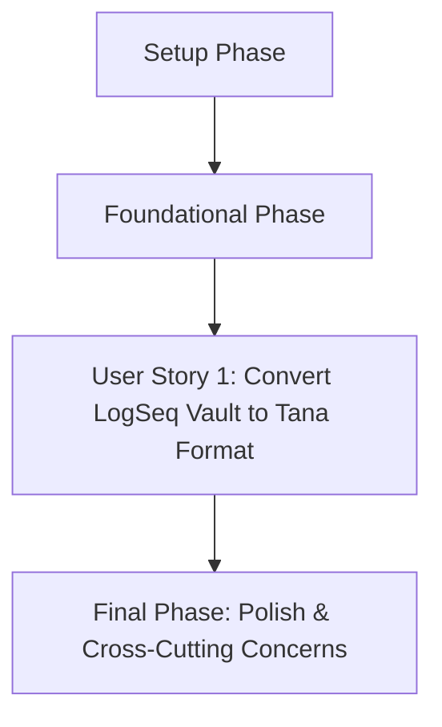

# Tasks: Export LogSeq to Tana Intermediate Format

**Feature Name**: Export LogSeq to Tana Intermediate Format
**Spec**: /specs/004-export-logseq-tana/spec.md
**Plan**: /specs/004-export-logseq-tana/plan.md

## Implementation Strategy

This feature will be implemented incrementally, focusing on an MVP-first approach. The initial focus will be on establishing the basic project structure and foundational components required for CLI operation and Tana data model definition. Subsequently, the core conversion logic will be developed and tested thoroughly for User Story 1, ensuring all specified functional requirements and acceptance criteria are met before moving to polish and cross-cutting concerns.

## Dependency Graph

The following graph illustrates the intended order of completing user stories:

## Parallel Execution Opportunities

Tasks marked with `[P]` can potentially be worked on in parallel as they have minimal direct dependencies on other concurrent tasks. These primarily include independent unit test creations or model definitions.

---

## Phase 1: Setup

**Goal**: Establish the basic project structure and verify development environment.

- [x] T001 Verify project setup (Python 3.14+, uv, ruff, pytest)
- [x] T002 Create `src/logseq_converter/tana/` directory and `__init__.py`
- [x] T003 Create empty file `src/logseq_converter/tana/converter.py`
- [x] T004 Create empty file `src/logseq_converter/tana/models.py`

## Phase 2: Foundational

**Goal**: Implement core CLI argument parsing and define the Tana Intermediate Format data models.

- [x] T005 Implement CLI argument parsing for `convert` command in `src/logseq_converter/cli.py`
- [x] T006 Implement `source_path` validation in `src/logseq_converter/utils.py`
- [x] T007 Implement `destination_path` validation (including overwrite check and `--force` option) in `src/logseq_converter/utils.py`
- [x] T008 Fetch `https://raw.githubusercontent.com/tanainc/tana-import-tools/refs/heads/main/src/types/types.ts`
- [x] T009 Parse `types.ts` and define Python data models for Tana Intermediate Format in `src/logseq_converter/tana/models.py`

## Phase 3: User Story 1 - Convert LogSeq Vault to Tana Format [US1]

**Story Goal**: As a user of both LogSeq and Tana, I want to convert my entire LogSeq vault into the Tana Intermediate Format, so that I can migrate my notes and knowledge base from LogSeq to Tana seamlessly.

**Independent Test Criteria**:
*   The conversion command executes without errors.
*   The output directory is populated with JSON files conforming to the Tana Intermediate Format, one per LogSeq page.
*   Importing the generated JSON files into Tana successfully preserves LogSeq content, structure (nested blocks), links, and tags/properties.

- [x] T010 [US1] Implement LogSeq page loading using `src/logseq_converter/logseq/parser.py` in `src/logseq_converter/tana/converter.py`
- [x] T011 [US1] Implement LogSeq block to Tana Node children mapping in `src/logseq_converter/tana/converter.py`
- [x] T012 [US1] Implement `[[wiki-links]]` conversion to Tana format in `src/logseq_converter/tana/converter.py`
- [x] T013 [US1] Implement `#tags` conversion to Tana supertags in `src/logseq_converter/tana/converter.py`
- [x] T014 [US1] Implement LogSeq `tags` property mapping to Tana supertags; ignore other properties in `src/logseq_converter/tana/converter.py`
- [x] T015 [US1] Implement JSON file generation (one per LogSeq page) in `src/logseq_converter/tana/converter.py`
- [x] T016 [US1] Integrate `logseq-to-tana convert` command with conversion logic in `src/logseq_converter/cli.py`
- [x] T017 [US1] Add error handling and warnings for invalid LogSeq vault and non-empty destination in `src/logseq_converter/cli.py`
- [x] T018 [US1] Add warning messages for out-of-scope LogSeq features in `src/logseq_converter/tana/converter.py`
- [x] T019 [P] [US1] Write unit tests for Tana models in `tests/unit/test_tana_models.py`
- [x] T020 [P] [US1] Write unit tests for `is_valid_logseq_vault` in `tests/unit/test_utils.py`
- [x] T021 [P] [US1] Write unit tests for conversion logic (mapping, links, tags, properties) in `tests/unit/test_tana_converter.py`
- [x] T022 [US1] Write integration tests for end-to-end conversion, including valid/invalid paths and force overwrite in `tests/integration/test_tana_conversion.py`

## Final Phase: Polish & Cross-Cutting Concerns

**Goal**: Ensure code quality, robust error handling, and comprehensive documentation.

- [x] T023 Refine error messages and warnings for user clarity in `src/logseq_converter/cli.py`
- [x] T024 Ensure CLI exit codes are correctly implemented in `src/logseq_converter/cli.py`
- [x] T025 Add comprehensive docstrings and type hints to `src/logseq_converter/tana/models.py`
- [x] T026 Add comprehensive docstrings and type hints to `src/logseq_converter/utils.py`
- [x] T027 Add comprehensive docstrings and type hints to `src/logseq_converter/tana/converter.py`
